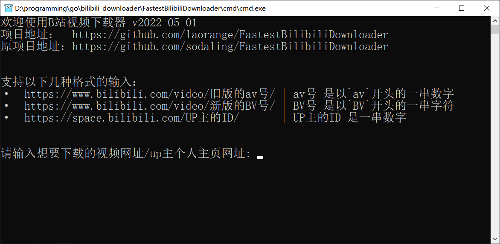

# FastestBibiliDownloader

## 原项目地址：**[ FastestBilibiliDownloader](https://github.com/sodaling/FastestBilibiliDownloader)**

> 项目仅用于学习交流，请勿用于任何商业用途！

## ⭐新增

自动解析 **想要下载的视频网址 / UP主个人主页网址**，支持：

- [x] [https://www.bilibili.com/video/**旧版的av号**/](#)，av号是以`av`开头的**一串数字**
- [x] [https://www.bilibili.com/video/**新版的BV号**/](#)，BV号是以`BV`开头的**一串字符**
- [x] [https://space.bilibili.com/**UP主的ID**/](#)，UP主的ID是**一串数字**



## ⚠较原项目的删减

+ 由于FFmeg拼接、转化耗时太长，故移除了 `video merge`中的功能 。下载后的视频为`.flv`格式。

-----

## 👍原项目说明

**东半球第二快的Bilibili.com（B站）视频下载器！**

如果你想下载b站某个up主的所有视频，而且要飞快的那种，那么你可以试试这个项目-.-

目前提供两个（三个）视频下载方案:

1. 通过视频的aid,下载单个视频.
2. 通过up主的upid(b站叫mid),下载这个up主所投稿的所有视频.
3. 通过视频的BVid,下载单个视频. **(new)**


> 特性:
>
> Github上下载b站视频代码已经有很多了.那么本下载器的特点是啥呢?
>
> 因为这是用Golang写的,当然了,也就利用了Golang的特性:goroutine.
>
> 简单来说,特点就是:
>
> **快!贼快!下载的视频越多越快！**
>
> * 当单个aid视频分了若干个part时候,或者当你选了下载up主下所有视频时候.多个视频将会同时并行下载,跑满你的网速绝对不是问题.
> * 下载与合并视频并行处理.如果视频分了多个part,下载完成的同时就会立即合并.该视频合并处理和其他与其他下载和合并同时进行且互不影响.

### 运行

下载的临时视频会存放在运行路径下的**download**文件夹下，每个视频（aid）一个文件夹，以**aid_视频标题**为文件夹名称。
最终的视频会存放在运行路径下的**output**文件夹下，每个aid一个文件夹，以**视频标题**为文件夹名称。
```shell
go run cmd/start-concurrent-engine.go -h   # 获得参数
```


#### 使用Golang编译环境

1. 安装Golang编译环境
* Ubuntu
```shell
sudo apt install golang
```

1.1 如果你在中国大陆，那么你大概率可能或许maybe需要配置代理才能顺利进行下一步。
```shell
go env -w GO111MODULE=on #启用Go Moledules
go env -w  GOPROXY=https://goproxy.io #使用官方代理
```

2. 一次性运行FastestBibiliDownloader
程序入口在**cmd/start-concurrent-engine.go**，只需要
```shell
go run cmd/start-concurrent-engine.go -t (aid/bvid/upid) -v (id)
```
首次运行会花时间下一大堆东西，然后按提示操作即可。
注意，合并视频需要FFmpeg的支持。不然只会下载并不会自动合并。FFmpeg的安装教程请咨询搜索引擎。

3. 编译FastestBibiliDownloader
```shell
go build cmd/start-concurrent-engine.go -t (aid/bvid/upid) -v (id)
```
之后直接运行./start-concurrent-engine即可。

#### 如果你没有Golang编译环境，或者没有FFmeg环境。那么推荐用docker方式运行。已经写好了dockefile和makefile。你只需要：

   ```shell
   $ cd FastestBilibiliDownloader
   $ make build #下载镜像
   $ make run #运行镜像
   ```

   

#### 后续有空会打包bin文件到release的。

### 感谢

1. engine部分的框架参考**ccmouse**的思路，后面自己调整了整体架构部分，非常感谢。
2. [bilibili-downloader](https://github.com/stevenjoezhang/bilibili-downloader)：b站请求视频的API等等都是从这位的代码获得，本身的py代码注释也非常清晰，非常感谢。
3. @sshwy帮忙抓虫纠错
4. @justin201802不厌其烦的帮忙修改

>欢迎各位提pr或者fork或者什么都行，能帮助到你的话欢迎star！疫情无聊在家磨时间的产物，粗糙了一点，欢迎各位完善～

